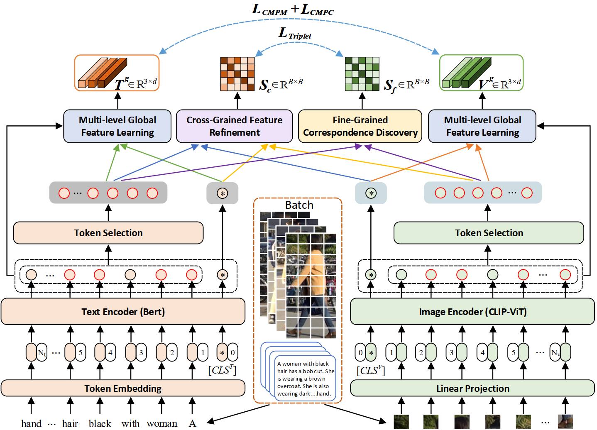

# CLIP-Driven Fine-grained Text-Image Person Re-identification
Official PyTorch implementation of the paper "[CLIP-Driven Fine-grained Text-Image Person Re-identification](https://arxiv.org/pdf/2210.10276.pdf)".


## Usage
### Requirements
we use single RTX3090 24G GPU for training and evaluation. 
```
Python 3.6.9
pytorch 1.7.0
torchvision 0.8.1
scipy 1.2.1
```

### Dataset Preparation
Download the CUHK-PEDES dataset from [here](https://github.com/ShuangLI59/Person-Search-with-Natural-Language-Description), ICFG-PEDES dataset from [here](https://github.com/zifyloo/SSAN) and RSTPReid dataset form [here](https://github.com/NjtechCVLab/RSTPReid-Dataset)

Organize them in `your dataset root dir` folder as follows:
```
|-- your dataset root dir/
|   |-- <CUHK-PEDES>/
|       |-- imgs
|            |-- cam_a
|            |-- cam_b
|            |-- ...
|       |-- reid_raw.json
|
|   |-- <ICFG-PEDES>/
|       |-- imgs
|            |-- test
|            |-- train 
|       |-- ICFG_PEDES.json
|
|   |-- <RSTPReid>/
|       |-- imgs
|       |-- data_captions.json
```

## Data Preparation
1. Run data.sh (or Download from [here](https://pan.baidu.com/s/1BVWznx_fDdiu_d-DTwbjNw?pwd=k8lr))
2. Copy files **test_reid.json**, **train_reid.json** and **val_reid.json** to project_directory/cuhkpedes/processed_data/


## Training

```python
python train.py 
```

## Testing

```python
python test.py
```

### Acknowledgments

Our code is extended from the following repositories. We sincerely appreciate for their contributions.

* [CLIP](https://github.com/openai/CLIP)
* [SAF](https://github.com/reallsp/SAF)

## Citation
If you find this code useful for your research, please cite our paper.

```tex
@article{CFine,
   title={CLIP-Driven Fine-grained Text-Image Person Re-identification}, 
   author={Shuanglin Yan and Neng Dong and Liyan Zhang and Jinhui Tang},
   journal={IEEE Transactions on Image Processing}, 
   year={2023},
   volume={},
   number={},
   pages={1-14},
   doi={10.1109/TIP.2023.3327924}
}
```

## Contact
If you have any question, please feel free to contact us. E-mail: [shuanglinyan@njust.edu.cn](mailto:shuanglinyan@njust.edu.cn).
